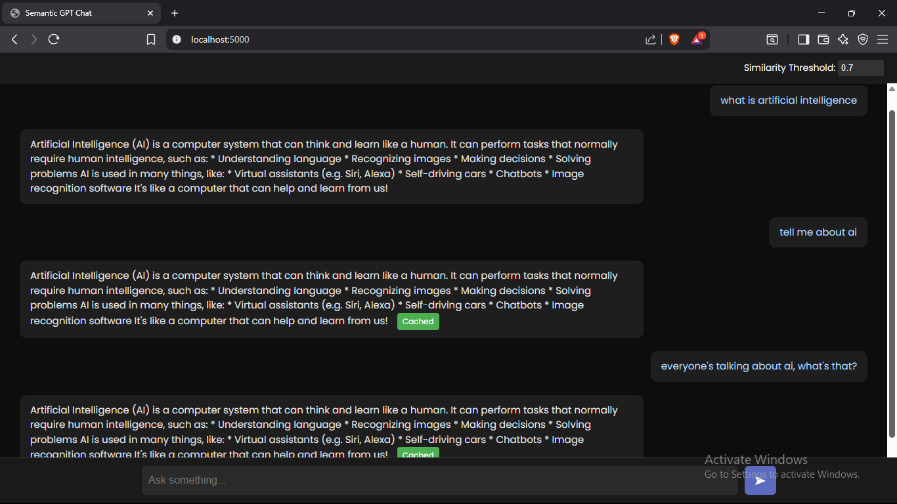

# SEMANTIC GPT CACHE

A smart and memory-efficient system that reduces repeated LLM calls using semantic similarity — saving both time and API cost.

---

# Objective

In the world of AI, **LLMs are powerful** but not cheap.  
Every repeated prompt is an expense.

This project brings a simple idea to life:

 "**If two questions feel the same, why not reuse the answer?**"

By embedding each query and checking similarity with previously asked ones, we can **cache responses intelligently**.

A small tweak like changing the **similarity threshold** can control how sensitive this match should be.

---

## 🔄 Workflow

```
User asks a question
     ↓
Convert it into a vector (embedding) using Gemini
     ↓
Check Redis for similar embeddings
     ↓
If found → return cached answer
Else → Ask Groq → Store in Redis → Return answer
```

---

##  Tech Used

| Tool     | Purpose                  |
|----------|---------------------------|
| Groq   | LLM response generation |
| Gemini | Embedding generator      |
| Redis  | Vector database (in-memory store) |

---

## ▶️ How to Run

1. Add your API keys to `.env`:
```
GOOGLE_API_KEY=your_gemini_api_key
GROQ_API_KEY=your_groq_api_key

if you dont have api_keys, check out docker execution
```

2. Run the project:
```
python main.py

```

You’ll be asking questions directly in the terminal. Type `exit` to quit.

---

## 🐳 Docker Support

_Coming soon..._

---

## 💡 Why This Matters?

This isn’t just caching — it’s **semantic caching**.

It remembers **meanings**, not exact words.  
It’s like your AI assistant saying:  
> _"Oh, you've already asked me something like that before!"_


